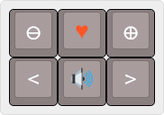
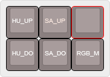
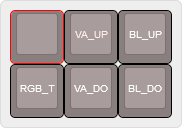
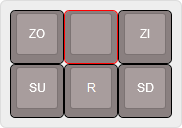

# Standard Layout
>[pr0board.hex](kbfirmware/pr0board.hex)

+ Plus
+ Add to favorites
+ Minus
+ Left
+ Audio on/off
+ Right

RGB functions
+ HU_UP (Hue Up)
+ HU_DO (Hue Down)
+ SA_UP (Saturation Up)
+ SA_DO (Saturation Down)
+ RGB_M (RGB Mode)

RGB and backlight functions
+ RGB_T (RGB Toggle)
+ VA_UP (Value Up)
+ VA_DO (Value Down)
+ BL_UP (Backlight Up)
+ BL_DO (Backlight Down)

extended navigation functions
+ ZO (Zoom Out)
+ ZI (Zoom In)
+ SU (Scroll Up)
+ SD (Scroll Down)
