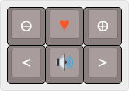
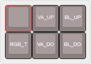
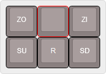

# Standard Layout
>[pr0board.hex](kbfirmware/pr0board.hex)

>Layer 0:
>Basisfunktionen

Die erste Tastenreihe gibt Zugriff auf die Funktionslayer, wenn die Tasten gedrückt und gehalten werden.
+ Plus (Layer 1)
+ Zu den Favoriten hinzufügen (Layer 3)
+ Minus (Layer 2)
+ Links
+ Ton an/aus
+ Rechts

>Layer 1:
RGB Funktionen
+ HU_UP (Farbwert anheben)
+ HU_DO (Farbwert senken)
+ SA_UP (Sättigung anheben)
+ SA_DO (Sättigung senken)
+ RGB_M (RGB Modus)

>Layer 2:
RGB und Backlight Funktionen
+ RGB_T (RGB An/Aus)
+ VA_UP (Helligkeit anheben)
+ VA_DO (Helligkeit senken)
+ BL_UP (Backlight heller)
+ BL_DO (Backlight dunkler)

>Layer 3:
Erweiterte Navigation
+ ZO (Verkleinern)
+ ZI (Vergrößern)
+ SU (Scroll rauf)
+ SD (Scroll runter)

