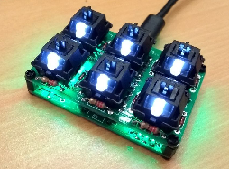
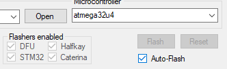

# pr0board

## Standard layout
In case you fucked up the firmware, you can always flash the standard layout to the pr0board. Use the [pr0board.hex](kbfirmware/pr0board.hex) and follow the steps of *Create your own layout/firmware*

## Create your own layout/firmware
You can create your own firmware with [http://kbfirmware.com/](http://kbfirmware.com/).
Use the provided [JSON file](kbfirmware/pr0board.json) and modify it according to your wishes.

Download the .hex file (**COMPILE** -> **Download .hex**) and load it onto your pr0board.
You can use the [QMK-Toolbox](qmk/qmk_toolbox.exe) from [https://github.com/qmk/qmk_toolbox](https://github.com/qmk/qmk_toolbox).

In QMK-Toolbox, choose your .hex file. The easyest way to flash your file is to check the **auto flash** option and then press the **RESET** button at the bottom of your pr0board.
You should now see the flashing process in the command window.
That's it. Close QMK-Toolbox and you're done. Your pr0board is now ready to go with your new firmware.
