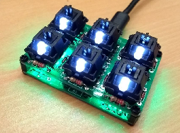
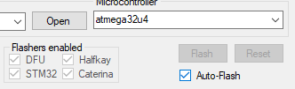



# pr0board

Das Navigations-Keyboard für pr0gramm.com.

Hier gehts zur [englischen Verion](README.md).

## Standardlayout

Näheres zum Standardlayout gibts [hier](LAYOUT_DE.md).

Falls ihr beim Flashen mal irgendwas verkackt habt, könnt ihr immer das Standardlayout drüberbügeln. Nehmt dazu das [pr0board.hex](kbfirmware/pr0board.hex) und befolgt die Schritte von *Erstelle dein eigenes Layout*.

## Erstelle dein eigenes Layout

### .hex File erstellen
Mit [http://kbfirmware.com/](http://kbfirmware.com/) könnt ihr eure eigene Firmware erstellen.
Benutzt dazu das bereitgestellte [JSON file](kbfirmware/pr0board.json) und passt es euren Wünschen an.

Ladet das .hex File herunter (**COMPILE** -> **Download .hex**) und flasht es auf euer pr0board.

### Flashen
Auf **Windows** könnt ihr die [QMK-Toolbox](qmk/qmk_toolbox.exe) von [https://github.com/qmk/qmk_toolbox](https://github.com/qmk/qmk_toolbox) benutzen.

In der QMK-Toolbox wählt ihr euer .hex file aus. Der einfachste Weg dieses nun auf das pr0board zu flashen ist, wenn ihr die Option **Auto-Flash** auswählt und dann den **RESET** Button auf der Unterseite eures pr0boards drückt.
Ihr solltet nun den Flash Prozess im Kommandozeilenfenster sehen.
Und das wars auch schon. Schließt die QMK-Toolbox und ihr seid fertig. Das pr0board ist jetzt einsatzbereit mit eurer neuen Firmware.

Auf **Linux** könnt ihr **avr dude** benutzen um den ATMEGA32u4 zu flashen. Und da ihr Linuxnutzer seid, wisst ihr sicher auch wie das geht oder seid zumindest dazu in der Lage, es zu googeln.
